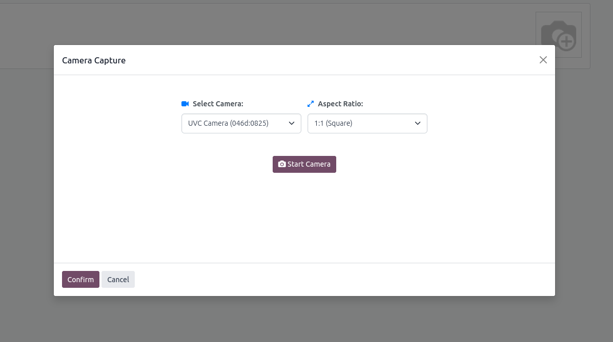
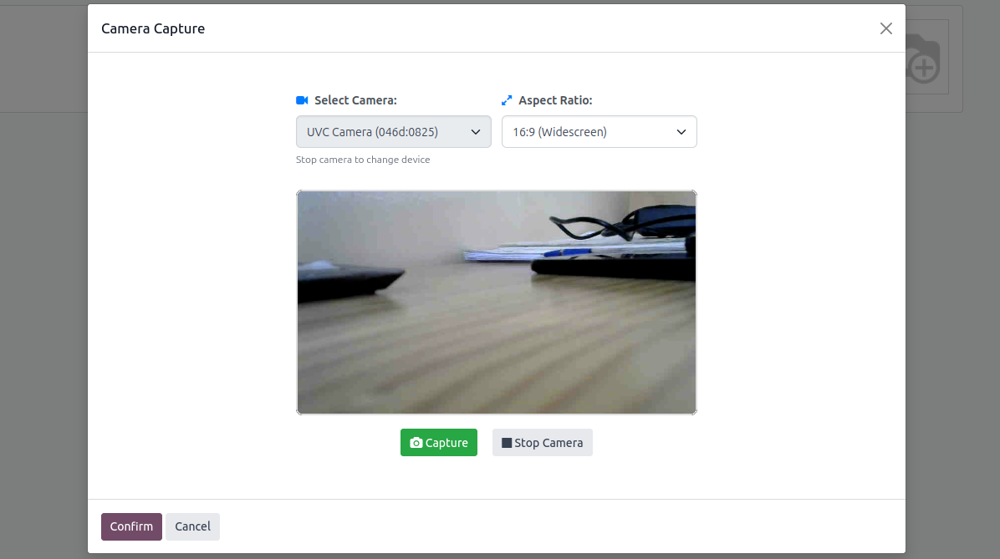

# Camera Capture Widget

> Capture images directly from your device camera in Odoo

## Overview

The Camera Capture Widget is a modern Odoo module that provides seamless image capture functionality directly from your device camera. Built specifically for Odoo with modern JavaScript and responsive design, it integrates seamlessly with Odoo's field system and provides a smooth user experience for capturing images from webcam or mobile device cameras.

## Features

### 🎥 Easy Camera Integration
- **Direct camera access** with device selection for multiple cameras
- **Flexible aspect ratio options** to match your requirements  
- **One-click image capture** with instant preview and retake functionality

### 📱 Perfect for Odoo
- ✅ Multiple camera device support
- ✅ Customizable aspect ratios
- ✅ Mobile-friendly interface
- ✅ Easy integration with any model

## Installation

Just install the module and start using the camera capture widget in your forms. No complex setup required - works out of the box with your existing Odoo installation.

### Requirements
- Odoo 18.0+
- Modern web browser with camera support
- HTTPS connection (required for camera access)

## Usage

1. Install the module from the Odoo App Store
2. Add the camera capture field to your model
3. Configure aspect ratio and camera settings as needed
4. Start capturing images directly in your forms

## Technical Details

- **Author:** Habib Mhamadi
- **Website:** [https://www.habib08.com](https://www.habib08.com)
- **License:** LGPL-3
- **Version:** 1.0
- **Category:** Technical

---

**Ready to Use** - Simple installation and configuration. Just install the module and start capturing images in your Odoo forms!
